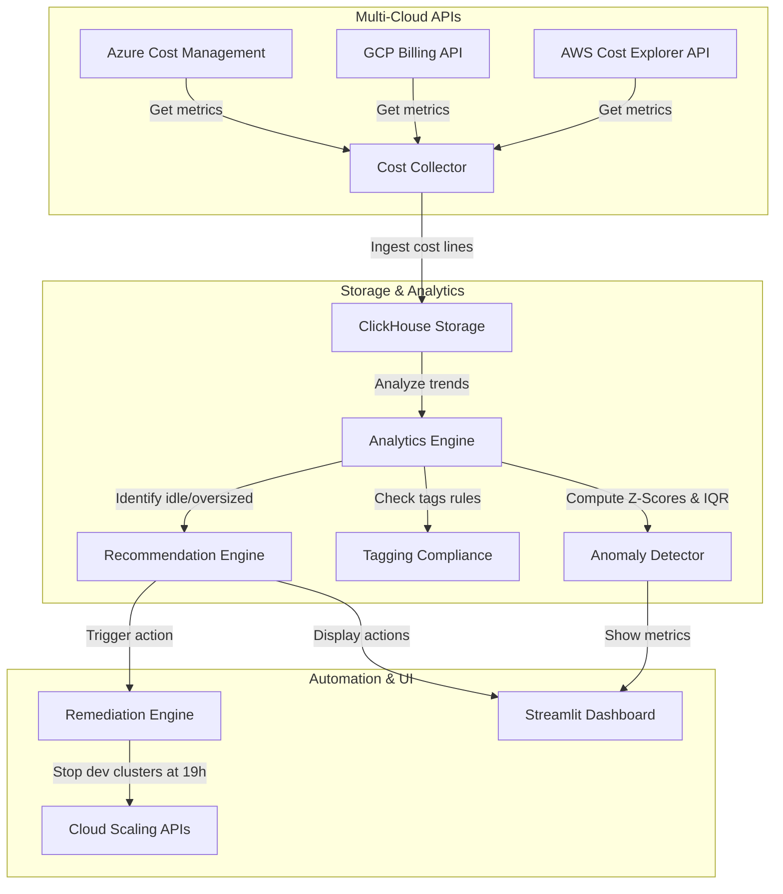

# Architecture — FinOps Engine

Cette plateforme collecte, analyse et optimise les coûts d'infrastructure cloud multi-cloud de la data platform pour identifier les dépenses anormales, les ressources inactives (Idle Resources) et proposer des plans de remédiation automatisés.

## Diagramme d'Architecture

## Description des Composants

### 1. Collecte de Données (Multi-Cloud Collector)
Le module `collector` implémente des connecteurs pour AWS, Azure et GCP. Ils récupèrent quotidiennement ou en continu les rapports de facturation enrichis par tags de ressources.

### 2. Moteur Analytique (Analytics Engine)
- **Anomaly Detector** : Calcule les Z-Scores et les écarts interquartiles (IQR) sur les séries temporelles de coûts pour identifier les "spikes" de dépenses anormaux (ex. un pipeline Spark resté allumé par erreur).
- **Tagging Compliance** : Valide que toutes les ressources cloud respectent les règles de tagging définies (ex. tag `Environment`, `Owner`, `Project`).
- **Recommendation Engine** : Détecte les ressources inactives (ex. IPs non attribuées, volumes orphelins) ou surdimensionnées (Over-provisioned) et génère des opportunités d'économie.

### 3. Automatisation des Actions (Remediation)
Le module `automation` implémente des politiques de remédiation exécutées à la demande ou planifiées (ex. extinction automatique des instances de développement en dehors des heures de bureau, réduction de la taille des instances selon les métriques d'utilisation réelles).

### 4. Interface FinOps (Streamlit Dashboard)
Tableau de bord interactif pour visualiser la répartition des coûts par équipe, suivre les anomalies récentes et valider les plans d'économies suggérés par le moteur de recommandations.

## Choix Technologiques & ADRs (Architecture Decision Records)

### ADR 1 : Stockage analytique sur ClickHouse
- **Alternative** : PostgreSQL ou base relationnelle classique.
- **Décision** : ClickHouse.
- **Raison** : Les tables de facturation cloud (billing exports) contiennent des millions de lignes de logs de granularité très fine. ClickHouse permet de requêter ces logs volumineux avec des agrégations instantanées à un coût de stockage minime grâce à sa compression en colonnes.

### ADR 2 : Détection d'anomalies statistique (Z-Score & IQR)
- **Alternative** : Modèle de Deep Learning prédictif (ex. LSTM).
- **Décision** : Z-Score + IQR combinés.
- **Raison** : Les modèles statistiques simples sont extrêmement rapides à calculer, ne nécessitent pas de phase d'entraînement complexe, et s'avèrent très fiables pour détecter les variations brutales typiques des dérives de coûts d'infrastructure.
